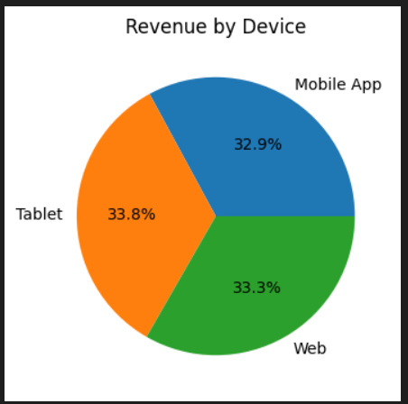
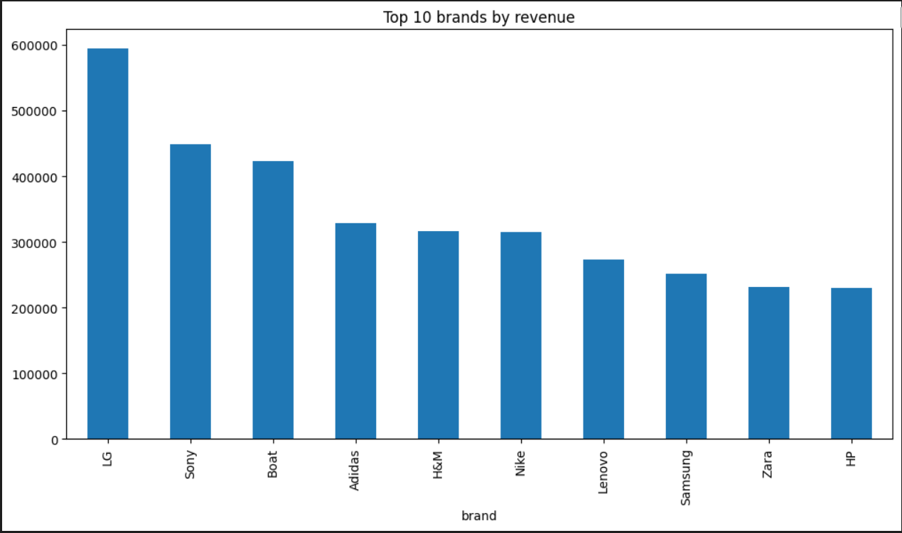
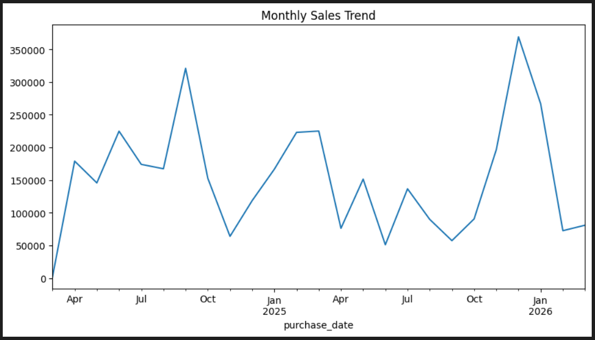

# 📊 Amazon E-commerce Data Analysis

## 🔍 Overview

This project explores an e-commerce dataset to uncover meaningful business insights, including sales trends, customer behavior, and revenue distribution across platforms.

The goal is to simulate a real-world data analyst workflow: data cleaning, analysis, visualization, and insight generation.

---

## 🛠 Tools & Technologies

* Python (Pandas, NumPy)
* Data Visualization (Matplotlib, Seaborn)
* SQL (for querying structured data)
* Jupyter Notebook

---

## 📊 Key Insights

* Revenue is evenly distributed across platforms (Mobile, Web, Tablet)
* Clear seasonal patterns observed in monthly sales
* Certain product categories and brands consistently outperform others
* Customer purchasing behavior shows repeat trends

---

## 📷 Visual Analysis

### 

### 📌 Additional Insights

---

## 🎯 Project Value

This project demonstrates:

* End-to-end data analysis workflow
* Ability to extract actionable insights from raw data
* Strong visualization and storytelling skills

---

## 👨‍💻 Author

Muhiddin Meliboyev

Aspiring Data Analyst | Python | SQL | Data Visualization
